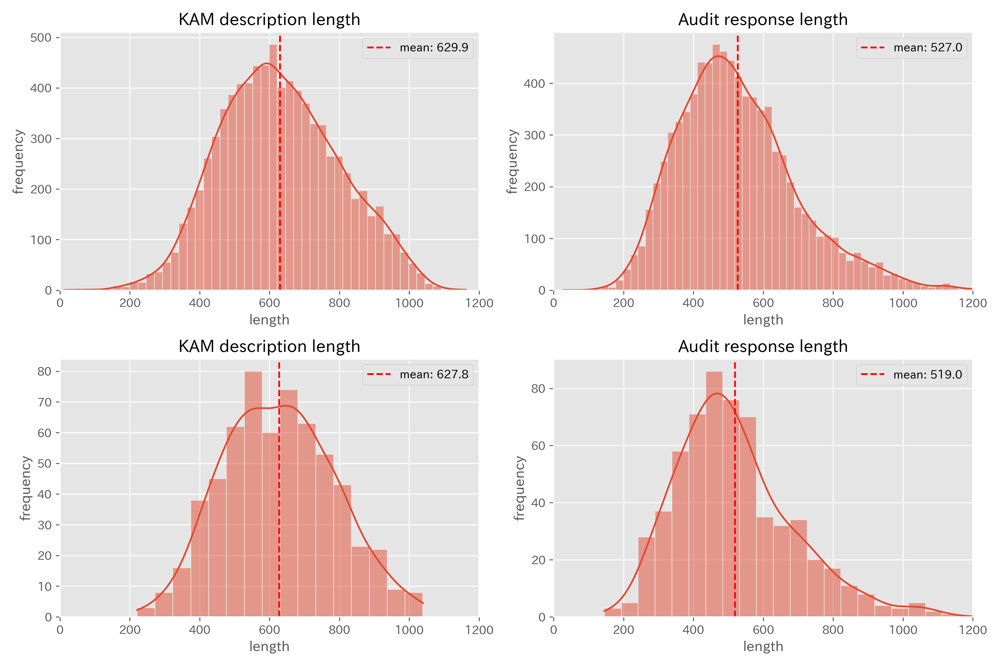

# repo_for_acc_diff_in_domain_specialization
Repository for "Acquisition Difference in Fine-tuning vs. In-Context learning: Multi-perspective Analysis of LLM Domain Specialization for Accounting Audit Procedure Generation"


# Dataset

### Terms of use
Term of use of original data from EDINET is also applied.
https://disclosure2.edinet-fsa.go.jp/week0010.aspx#

In addition to the term of use above ,since the column "audit_res_md_converted" is output of Llama-3.1-8B model, in which audit response -column "audit_res"- is converted to markdown style by Llama-3.1-8B, term of use of Meta Llama model is applied.
https://github.com/meta-llama/llama-models/blob/main/models/llama3_1/LICENSE

### description

|                      | Train | Eval |
| -------------------- | ----- | ---- |
| Number of KAMs       | 8350  | 607  |
| Number of Submitters | 3548  | 500  |

Distribution of data length (word count in Japanese)


**Example of training data (original in Japanese)**
Copyright belongs to the auditor or submitter.
| id                                    | description                                                                                                                                                                                                                                                                                                                                                                                                                                                                                                  | audit_res                                                                                                                                                                                                                                                                                                                                                                                                                                                                                                                                                                                                                | audit_res_md                                                                                                                                                                                                                                                                                                                                                                                                                                                                                                                                                                                                             | auditor_name | submitter_name |
| ------------------------------------- | ------------------------------------------------------------------------------------------------------------------------------------------------------------------------------------------------------------------------------------------------------------------------------------------------------------------------------------------------------------------------------------------------------------------------------------------------------------------------------------------------------------ | ------------------------------------------------------------------------------------------------------------------------------------------------------------------------------------------------------------------------------------------------------------------------------------------------------------------------------------------------------------------------------------------------------------------------------------------------------------------------------------------------------------------------------------------------------------------------------------------------------------------------ | ------------------------------------------------------------------------------------------------------------------------------------------------------------------------------------------------------------------------------------------------------------------------------------------------------------------------------------------------------------------------------------------------------------------------------------------------------------------------------------------------------------------------------------------------------------------------------------------------------------------------ | ------------ | -------------- |
| S100KY0O_FilingDateInstant_Row1Member | 会社は、前連結会計年度において、中東地域に新たな日本的な米飯加工市場を創造する取り組みを行うため、中東地域で米飯加工品の製造販売を行うBluefin Trading LLC(以下、Bluefin)の株式を35%取得し、持分法適用関連会社としている。会社は、当該株式の取得に当たり、超過収益力等を考慮したうえで取得価額を決定しており、当連結会計年度末における当該株式の持分法適用による連結貸借対照表価額161,169千円には、125,958千円ののれんが含まれている。そのため、会社はBluefinの決算情報や将来事業計画のモニタリングを実施し、株式取得時に見込んだ超過収益力等が減少していないかどうかの判断をしている。当該判断の根拠となる将来事業計画は、売上高成長率や売上総利益率等の重要な仮定が含まれていることから、経営者の主観的な判断に依存する程度が高く、昨今の新型コロナウイルス感染症の影響により、見積りの不確実性が高まっている。したがって、当監査法人は、Bluefin株式の連結貸借対照表価額に含まれるのれんの評価の妥当性について、監査上の主要な検討事項に該当すると判断した。 | 当監査法人は、Bluefin株式の連結貸借対照表価額に含まれるのれんの評価の妥当性を検討するに当たり、主に以下の監査手続を実施した。 (1)内部統制の評価Bluefin株式の連結貸借対照表価額に含まれるのれんの減損の兆候の把握に関連する内部統制の整備状況及び運用状況を評価した。なお、評価した内部統制には、Bluefinの決算情報や将来事業計画のモニタリングを含んでいる。 (2)減損の兆候の把握に関する検討会社がBluefin株式の連結貸借対照表価額に含まれるのれんの減損の兆候の把握を適切に実施していることを確かめるため、減損の兆候を把握するための内部資料を閲覧し、株式取得時に見込まれた超過収益力等が減少していないかどうかの判断の過程及び結果の合理性を検討した。また、減損の兆候を把握する際に用いられた将来事業計画の合理性及び実行可能性を検討するため、主に以下の監査手続を実施した。・ 株式取得時ののれんの評価に用いられた将来事業計画と実績の比較分析を実施し、実績が将来事業計画から乖離した状況がある場合には、その要因分析を行うことで、将来事業計画の精度を評価した。これには、新型コロナウイルス感染症が将来事業計画に及ぼす影響の評価を含んでいる。・ 将来事業計画の前提となる売上高成長率や売上総利益率等の重要な仮定の合理性を検討するため、利用可能な過去実績データや外部データとの比較を実施した。 | 監査人は、Bluefin株式の連結貸借対照表価額に含まれるのれんの評価の妥当性を検討するに当たり、主に以下の監査手続を実施する。 * 内部統制の評価 Bluefin株式の連結貸借対照表価額に含まれるのれんの減損の兆候の把握に関連する内部統制の整備状況及び運用状況を評価する。なお、評価した内部統制には、Bluefinの決算情報や将来事業計画のモニタリングを含んでいる。 * 減損の兆候の把握に関する検討 会社がBluefin株式の連結貸借対照表価額に含まれるのれんの減損の兆候の把握を適切に実施していることを確かめるため、減損の兆候を把握するための内部資料を閲覧し、株式取得時に見込まれた超過収益力等が減少していないかどうかの判断の過程及び結果の合理性を検討する。また、減損の兆候を把握する際に用いられた将来事業計画の合理性及び実行可能性を検討するため、主に以下の監査手続を実施する。 * 株式取得時ののれんの評価に用いられた将来事業計画と実績の比較分析を実施し、実績が将来事業計画から乖離した状況がある場合には、その要因分析を行うことで、将来事業計画の精度を評価する。これには、新型コロナウイルス感染症が将来事業計画に及ぼす影響の評価を含んでいる。 * 将来事業計画の前提となる売上高成長率や売上総利益率等の重要な仮定の合理性を検討するため、利用可能な過去実績データや外部データとの比較を実施する。 | 太陽有限責任監査法人   | 鈴茂器工株式会社       |

Example of training data (English translated)
Copyright belongs to the auditor or submitter. And the translation is done by the author.

| id                                    | description                                                                                                                                                                                                                                                                                                                                                                                                                                                                                                                                                                                                                                                                                                                                                                                                                                                                                                                                                                                                                                                                                                                                                                                                       | audit_res                                                                                                                                                                                                                                                                                                                                                                                                                                                                                                                                                                                                                                                                                                                                                                                                                                                                                                                                                                                                                                                                                                                                                                                                                                                                                                                                                                                                                                                                                                                                                                                                                                                                                                                                                                                                                                                                  | audit_res_md                                                                                                                                                                                                                                                                                                                                                                                                                                                                                                                                                                                                                                                                                                                                                                                                                                                                                                                                                                                                                                                                                                                                                                                                                                                                                                                                                                                                                                                                                                                                                                                                                                                                                                                                                                                                                  | auditor_name             | submitter_name            |
| ------------------------------------- | ----------------------------------------------------------------------------------------------------------------------------------------------------------------------------------------------------------------------------------------------------------------------------------------------------------------------------------------------------------------------------------------------------------------------------------------------------------------------------------------------------------------------------------------------------------------------------------------------------------------------------------------------------------------------------------------------------------------------------------------------------------------------------------------------------------------------------------------------------------------------------------------------------------------------------------------------------------------------------------------------------------------------------------------------------------------------------------------------------------------------------------------------------------------------------------------------------------------- | -------------------------------------------------------------------------------------------------------------------------------------------------------------------------------------------------------------------------------------------------------------------------------------------------------------------------------------------------------------------------------------------------------------------------------------------------------------------------------------------------------------------------------------------------------------------------------------------------------------------------------------------------------------------------------------------------------------------------------------------------------------------------------------------------------------------------------------------------------------------------------------------------------------------------------------------------------------------------------------------------------------------------------------------------------------------------------------------------------------------------------------------------------------------------------------------------------------------------------------------------------------------------------------------------------------------------------------------------------------------------------------------------------------------------------------------------------------------------------------------------------------------------------------------------------------------------------------------------------------------------------------------------------------------------------------------------------------------------------------------------------------------------------------------------------------------------------------------------------------------------- | ----------------------------------------------------------------------------------------------------------------------------------------------------------------------------------------------------------------------------------------------------------------------------------------------------------------------------------------------------------------------------------------------------------------------------------------------------------------------------------------------------------------------------------------------------------------------------------------------------------------------------------------------------------------------------------------------------------------------------------------------------------------------------------------------------------------------------------------------------------------------------------------------------------------------------------------------------------------------------------------------------------------------------------------------------------------------------------------------------------------------------------------------------------------------------------------------------------------------------------------------------------------------------------------------------------------------------------------------------------------------------------------------------------------------------------------------------------------------------------------------------------------------------------------------------------------------------------------------------------------------------------------------------------------------------------------------------------------------------------------------------------------------------------------------------------------------------- | ------------------------ | ------------------------- |
| S100KY0O_FilingDateInstant_Row1Member | The company has acquired 35% of the shares of Trading LLC (hereinafter referred to as Bluefin) and made it an equity-method affiliate. The company determined the acquisition price taking into account excess profitability and other factors, and the consolidated balance sheet value of 161,169 thousand yen based on the equity method at the end of the current consolidated fiscal year includes goodwill of 125,958 thousand yen. Therefore, the company monitors Bluefin's financial information and future business plans to determine whether the excess profitability and other factors anticipated at the time of the share acquisition have decreased. Since the future business plans that form the basis for this determination include important assumptions such as sales growth rate and gross profit margin, they depend to a high degree on management's subjective judgment, and the uncertainty of estimates has increased due to the recent impact of the COVID-19 pandemic. Consequently, we, the auditing firm, have determined that the appropriateness of the valuation of goodwill included in the consolidated balance sheet value of Bluefin shares falls under key audit matters. | In examining the appropriateness of goodwill valuation included in the consolidated balance sheet value of Bluefin shares, our audit firm primarily performed the following audit procedures:(1) Evaluation of Internal Controls We evaluated the design and operational effectiveness of internal controls related to identifying indications of impairment for goodwill included in the consolidated balance sheet value of Bluefin shares. The evaluated internal controls included monitoring of Bluefin's financial information and future business plans.(2) Examination of Impairment Indicators To verify that the company appropriately identified indications of impairment for goodwill included in the consolidated balance sheet value of Bluefin shares, we reviewed internal documentation used to identify impairment indicators and examined the reasonableness of the process and results of determining whether the excess profitability expected at the time of share acquisition had decreased. Additionally, to examine the reasonableness and feasibility of future business plans used in identifying impairment indicators, we primarily performed the following audit procedures: We conducted comparative analysis between future business plans used in the evaluation of goodwill at the time of share acquisition and actual performance. When actual performance deviated from future business plans, we analyzed the factors to evaluate the accuracy of future business plans. This included evaluating the impact of the COVID-19 pandemic on future business plans. To examine the reasonableness of significant assumptions underlying future business plans, such as sales growth rates and gross profit margins, we compared them with available historical performance data and external data. | When evaluating the appropriateness of goodwill valuation included in the consolidated balance sheet value of Bluefin shares, the auditor primarily performs the following audit procedures:<br><br>- Evaluation of Internal Controls Evaluate the design and operating effectiveness of internal controls related to identifying indicators of impairment for goodwill included in the consolidated balance sheet value of Bluefin shares. The evaluated internal controls include monitoring of Bluefin's financial information and future business plans.<br>- Assessment of Impairment Indicators To verify that the company has appropriately identified indicators of impairment for goodwill included in the consolidated balance sheet value of Bluefin shares, review internal documentation used to identify impairment indicators and examine the reasonableness of the process and results of determining whether the excess profitability expected at the time of share acquisition has diminished. Additionally, to assess the reasonableness and feasibility of future business plans used in identifying impairment indicators, primarily perform the following audit procedures:<br>- Conduct comparative analysis between the future business plans used in the evaluation of goodwill at the time of share acquisition and actual results. When actual results deviate from future business plans, analyze the factors to evaluate the accuracy of future business plans. This includes assessing the impact of the COVID-19 pandemic on future business plans.<br>- To examine the reasonableness of significant assumptions underlying the future business plans, such as sales growth rates and gross profit margins, perform comparisons with available historical performance data and external data. | Grant Thornton Taiyo LLC | SUZUMO MACHINERY Co.,Ltd. |


### training data
- `dataset/data_train_markdown_1012.csv`: training data for fine-tuning

summary of data is described in `dataset/data_train_markdown_1012.json`

### evaluation data
- `dataset/data_validation_1012.csv`: evaluation data
The evaluation dataset below is few-shot added version of this dataset.

summary of data is described in `dataset/data_validation_1012.json`
#### evaluation data experiment 1
For Plain, SFT-IT, SFT-CV
- `dataset/audit_res_markdown_eval.csv`: evaluation data converted to markdown style by Llama-3.1-8B
For ICL(4-nearest)-qwen2
- `dataset/few_shot/gen_audres_4-nearest.jsonl`: evaluation data with nearest 4 shot
For ICL(1-nearest-1-various)-Llama3.1 and Swallow
- `dataset/few_shot/gen_audres_4-nearest.jsonl`: evaluation data with nearest 1 shot and 1 various


#### evaluation data for experiment 2 (ablation study of few-shot setting)
##### for Qwen2 following few-shot evaluation data is used.
- `dataset/few_shot/gen_audres_1-nearest.jsonl`: evaluation data with nearest 1 shot
- `dataset/few_shot/gen_audres_2-nearest.jsonl`: evaluation data with nearest 2 shot
- `dataset/few_shot/gen_audres_3-nearest.jsonl`: evaluation data with nearest 3 shot
- `dataset/few_shot/gen_audres_4-nearest.jsonl`: evaluation data with nearest 4 shot
- `dataset/few_shot/gen_audres_5-nearest.jsonl`: evaluation data with nearest 5 shot

- `dataset/few_shot/gen_audres_1-nearest-3-various.jsonl`: evaluation data with nearest 2 shot
- `dataset/few_shot/gen_audres_4-random.jsonl`: evaluation data with nearest 2 shot

##### for Llama 3.1 and Swallow following few-shot evaluation data is used.
- `dataset/few_shot/gen_audres_1-nearest.jsonl`: evaluation data with nearest 1 shot
- `dataset/few_shot/gen_audres_2-nearest.jsonl`: evaluation data with nearest 2 shot
- `dataset/few_shot/gen_audres_3-nearest.jsonl`: evaluation data with nearest 3 shot

- `dataset/few_shot/gen_audres_1-nearest-1-various.jsonl`: evaluation data with nearest 2 shot
- `dataset/few_shot/gen_audres_2-random.jsonl`: evaluation data with nearest 2 shot

#### evaluation data experiment 3
For ICL baseline, SFT-IT (1-nearest), SFT-CV (1-nearest) and SFT-FS
- `dataset/few_shot/gen_audres_1-nearest.jsonl`: evaluation data with nearest 1 shot
For ICL(4-nearest)-qwen2 (best ICL)
- `dataset/few_shot/gen_audres_4-nearest.jsonl`: evaluation data with nearest 4 shot
For ICL(1-nearest-1-various)-Llama3.1 and Swallow (best ICL)
- `dataset/few_shot/gen_audres_1-nearest-1-various.jsonl`: evaluation data with nearest 1 shot and 1 various

### metadata
- `dataset/response_tbl_with_year.pkl`: all metadata of downloaded documents from EDINET API
This file is only used for getting list of document-id (docid), and can be read as following:
```python
import pandas asa pd
response_tbl = pd.read_pickle("./dataset/response_tbl_with_year.pkl")
```


# source code
## src_data_download
The script to download data from EDINET is described.
Sample code for data acquition is described in `src_data_download/sample_download_edinetapi.ipynb`

## src_preprocessing
The script to preprocess data is described.
- `src_preprocessing/ds01_01_check_dataset.py`: Extract KAM data from downloaded XBRL data and normalize unicode of the text
- `src_preprocessing/ds01_02_make_dataset_kam_generator.py`: Preprocess the extracted KAM data
- `src_preprocessing/ds01_03_dataset_aplit.py`: Define train and validation dataset for fine-tuning
- `src_preprocessing/ds01_04_emb_kam.py`: Get vector expression of KAM description text by multilingual-e5 embedding.
- `src_preprocessing/ds01_05_clustering_kam.py`: Clustering KAM description text by UMAP and DBSCAN into KAM topics, which is used for training detail domain adaptation model (Detail-SFT-IT and Detail-SFT-CV).

The preprocessed dataset are in `dataset/`

## src_finetuning
The script to fine-tune LLM is described.
The config containing hyperparameters is described in `src_finetuning/cfg/xxxx.yaml`
```python
python fine_tuning.py --cfg_path_str ./cfg/xxxx.yaml --model_save_dir xxxx --filename_train_data ../dataset/data_train_markdown_1012.csv
```
## src_inference
The script to generate audit response is described.
##### for zero-shot setting
```python
python inference.py --cfg_path_str ./cfg/xxxx.yaml --output_filename xxxx --filename_eval_data ../dataset/audit_res_markdown_eval.csv --inf_mode zero-shot
```
##### for few-shot setting
```python
python inference.py --cfg_path_str ./cfg/xxxx.yaml --output_filename xxxx --filename_eval_data ../dataset/few_shot/gen_audres_1-nearest.jsonl --inf_mode few-shot
```

## src_evaluation
The script to evaluate the performance of LLM is described.
- `src_evaluation/ds01_05_eval.py`: Evaluate the generation
- `src_evaluation/ds01_05_gen_data_for_eval.py`: Prepare QA dataset (masking dataset) for accuracy evaluation


## prompt
- `prompt/eval_prompt.json`: the prompt used for evaluation is described.
- `prompt/eval_prompt_eng.json`: English translated version of the prompt above.

## results
All evaluation results are described in this directory.
- `results/eval_result_df.csv`: evaluation results for each evaluation instance
- `results/eval_result_summary.csv`: summary of evaluation results (averaged scores)